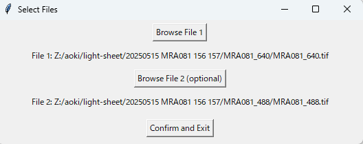
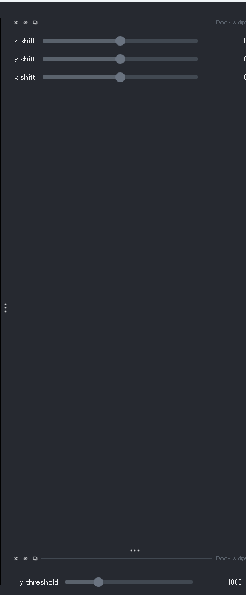
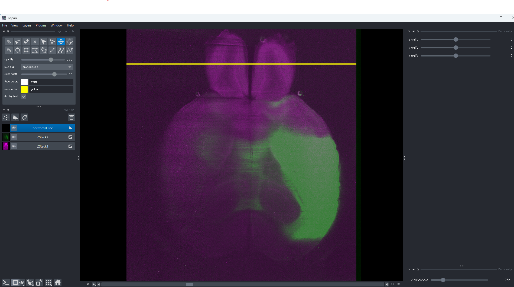

# 📖 manual-aligner-tool

manually align volumes of two channels obtained by light-sheet microscope

## 📚 Overview

This repository provides a graphical user interface (GUI) tool designed for manual inspection, alignment, and cropping of volumetric imaging datasets, primary for the purpose of preprocessing light-sheet fluorescence microscope images of biological tissue (e.g. cleared brain), for registration to the common reference coordinate (e.g. atlas).  
The entire pipeline for tissue clearance, image acquistiion and registration will be published SOON.


---

## ✨ Features

- Load one or two volumetric image stacks (e.g., `.tif` files)
- Visualize multi-channel images with adjustable colormaps and opacity
- Apply manual Z/Y/X translation to secondary images for alignment
- Dynamically adjust a Y-axis threshold to crop the image
- Save shifted or masked images directly from the GUI interface

---

## 📦 Installation

It is recommended to use a dedicated virtual environment, such as conda or venv. For example,

```bash
cd (yourfolderpath) # where you downloaded this folder e.g. Documents\github\manual-aligner-tool)
conda env create -f environment.yml
conda actiavate manual-aligner # enter the enviroment you created
```

## ▶️ Usage
1. Run below code in manual-aligner environment 
```bash
python manual_aligner.py
```

2. Select .tif files you want to align/crop.
- If you have two images, 1st image is used as a reference (e.g. not moved) and 2nd image will be moved to match 1st one.
- If you have one image and only want to crop, leave 2nd file empty.
- After selecting files, press "Confirm and Exit".


3. Napari GUI will open with widgets at the right. 

Adjust y threshold to move the yellow horizontal bar, above which the image will be cropped (padded with background intensity). If you have two images, adjust xyz shift to match two images. Then close the window.


4. The new images will be saved as (ORIGINALFILENAME)_new.tif in the same directory. Napari open again with new images to confirm the result with visual inspection. 


